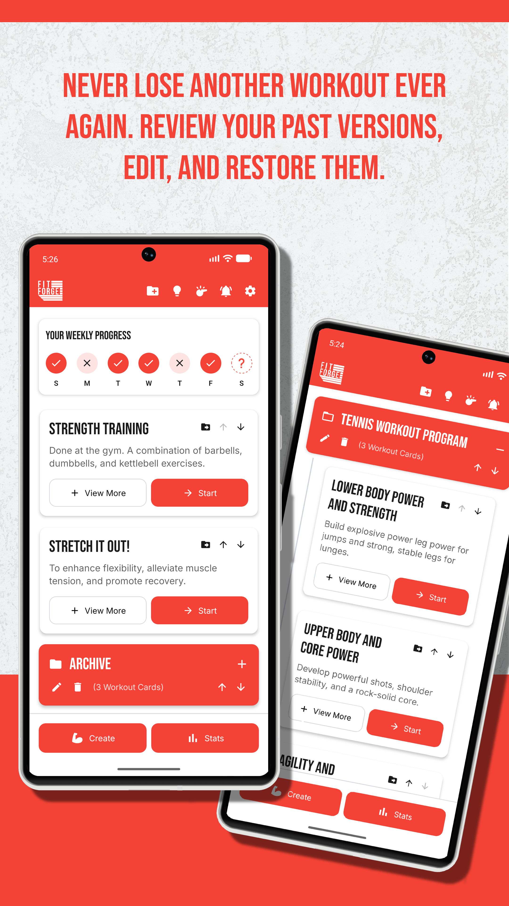
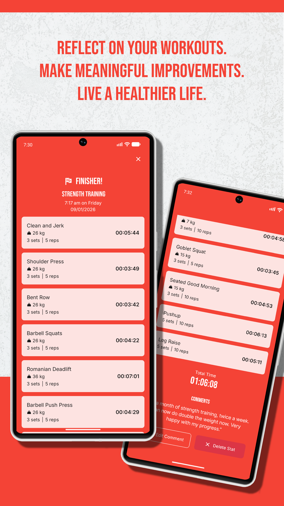
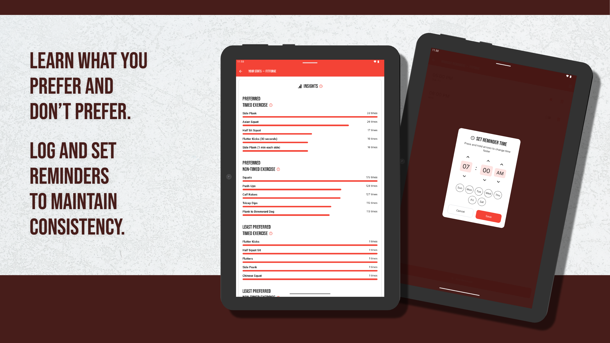
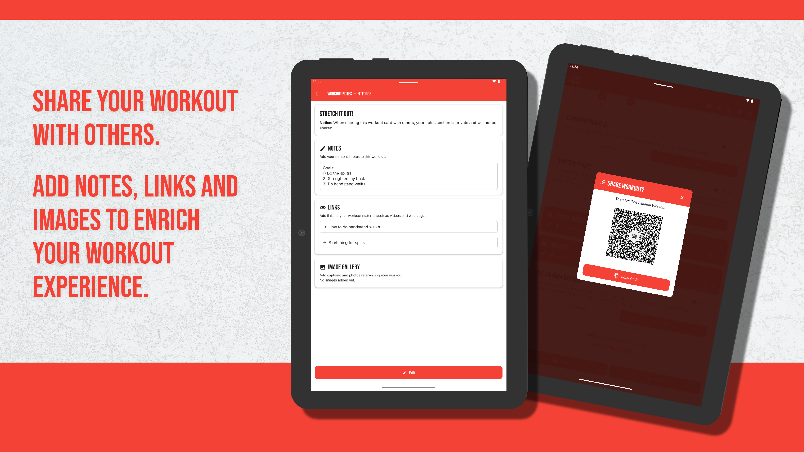
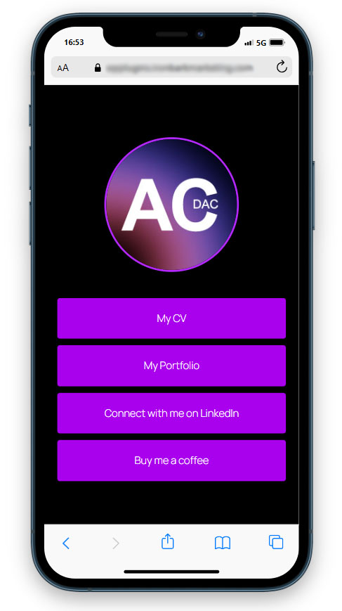
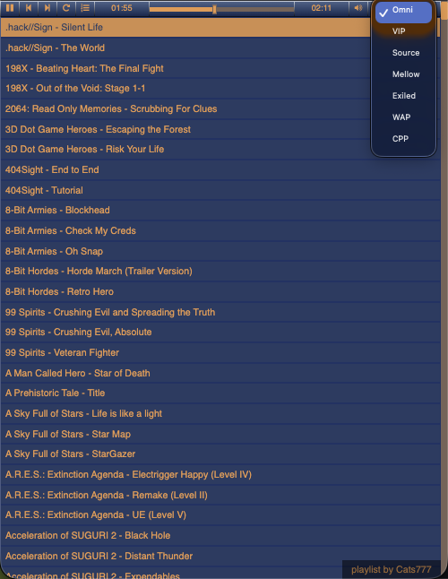
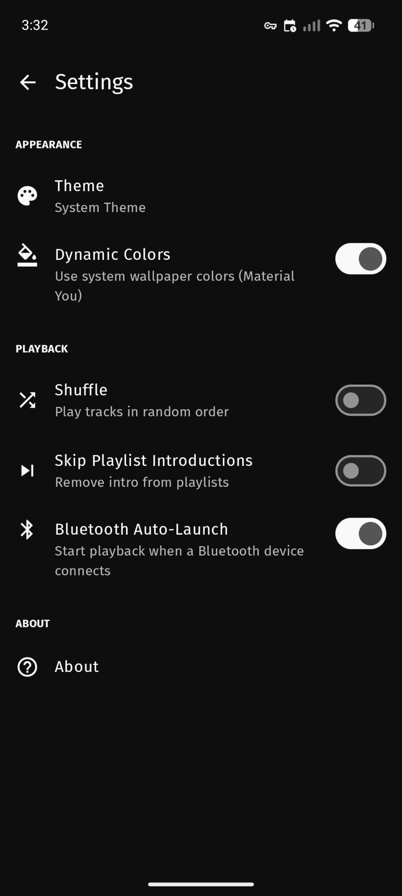

# Hey, I'm Alex 👋
Digital Producer with 14+ years in multimedia and design, transitioning into DevOps engineering. I bring systems thinking from a production background, understanding how things are built, delivered, and maintained, and I'm applying that to infrastructure, automation, and deployment pipelines.
 
---
 
## What I'm Working On
- Building a DevOps learning path hands-on: Linux → Git → Docker → CI/CD → Cloud → IaC → Observability
- Deploying and maintaining real infrastructure on a self-hosted Raspberry Pi 4B lab environment
- Automating Android app delivery for FitForge via GitHub Actions → EAS Build → Google Play Store
 
---
 
## Projects
 
### [FitForge](https://github.com/AC-DAC/FitForge-Public)
Privacy-first workout tracking app for Android. No ads, no account required, all data stored on-device. Features custom workout creation, guided session mode, stats and insights, reminders, and QR code workout sharing. Built in React Native / Expo with a custom Material Design-inspired design system. Currently in closed testing on the Google Play Store.
 
CI/CD pipeline: GitHub Actions `test → build → submit` on version tag push. Jest unit test suite. EAS Build produces AAB artifact; EAS Submit delivers to Play Store internal track via Google Service Account (least-privilege permissions). Actions pinned to immutable commit SHAs with `permissions: contents: read` at workflow level. Lefthook + gitleaks for pre-commit secret scanning.
 
<table>
  <tr>
    <td></td>
    <td></td>
    <td></td>
  </tr>
</table>
 
<table>
  <tr>
    <td></td>
    <td></td>
  </tr>
  <tr>
    <td></td>
    <td></td>
  </tr>
</table>
 
`React Native` `Expo` `GitHub Actions` `EAS Build` `Jest` `Android`

---

### [Quicklinks](https://github.com/AC-DAC/Quicklinks-Public)
WordPress plugin built at Ironbark Marketing that generates a branded link directory page at `yourdomain.com/quicklinks/`. Customisable profile image, background and button colours, drag-and-drop link reordering. CI/CD pipeline via GitHub Actions: PHPCS validation enforcing WordPress Coding Standards, zip packaging, and automated GitHub Releases on version tag push.

<table>
  <tr>
    <td></td>
    <td></td>
    <td></td>
  </tr>
</table>
 
`WordPress` `PHP` `GitHub Actions` `PHPCS`

---
 
### [Mothership — Centralised WordPress Management Infrastructure](https://github.com/AC-DAC/Mothership-Public)
Self-hosted centralised management dashboard for over 15 production WordPress client sites, built on MainWP and deployed to a dedicated subdomain. Replaces a manual, site-by-site update workflow with a single control plane covering bulk updates, uptime monitoring, and security visibility across all managed sites.
 
Key implementation decisions: real server-level cron over WP-Cron (unreliable on a low-traffic dashboard-only subdomain); per-site OpenSSL key pairs with Unique Security IDs replacing password authentication; maintenance mode for frontend obscurity after directory password protection was evaluated and rejected (intercepts WordPress core HTTP requests). Backup strategy layered across UpdraftPlus per-site (weekly) and VentraIP server-level hourly snapshots.
 

 
`MainWP` `WordPress` `Apache` `MariaDB` `Linux` `Cron`

---
 
### [Aersia VIPVGM Player — Self-Hosted Fork](https://github.com/AC-DAC/aersia-vip-player-self-hosted-fork)
Self-hosted video game music player running on a Raspberry Pi 4B. Forked and significantly extended from an upstream HTML5 player: migrated playlist parsing from XML to JSON (vipvgm.net API), added sequential playback mode, Source playlist with CDN fallback logic, and Omni playlist (client-side merge of VIP, Mellow, and Exiled sorted A-Z). Full localStorage persistence across sessions with sequential position restoration fix.
 
Infrastructure: Nginx, Let's Encrypt TLS (DNS-01 challenge via Cloudflare plugin), dynamic DNS automation via Cloudflare API, CORS resolved via local Pi proxy serving roster files refreshed weekly by cron.
 

 
`Nginx` `Let's Encrypt` `Cloudflare` `Bash` `Linux` `Cron`

---

### [Aersia VIPVGM Player — Android](https://github.com/AC-DAC/aersia-vip-player-android)
Native Android companion app to the self-hosted web player, built as a fork of [VidyaMusic by MateusRodCosta](https://github.com/MateusRodCosta/VidyaMusic). The web player originally shipped a PWA for mobile use, but background audio proved unreliable on Android due to OS power management — a native app was the correct solution.

Extended from upstream to achieve full playlist parity with the web player: XML/XSPF roster support for WAP and CPP playlists, Source playlist with source-file filtering, and Omni (concurrent fetch of all six playlists, merged and sorted A-Z). Per-playlist position memory with atomic snapshot persistence, shuffle state persistence, and Bluetooth auto-launch notification support.

CI/CD pipeline: GitHub Actions `assembleDebug` on version tag push, APK attached to GitHub Release. Actions pinned to immutable commit SHAs. Licensed AGPLv3.

<table>
  <tr>
    <td></td>
    <td></td>
    <td></td>
    <td></td>
  </tr>
</table>

`Kotlin` `Jetpack Compose` `Media3` `GitHub Actions` `Gradle` `Android`

---

## Technologies
 
**Infrastructure & DevOps**
Linux · Nginx · Docker · Docker Compose · GitHub Actions · Bash · Cron · UFW · SSH · Cloudflare · Let's Encrypt · Certbot · EAS CLI
 
**Development**
React Native · Expo · Kotlin · JavaScript · PHP · HTML · CSS
 
**Tools**
Git · Jest · Lefthook · EAS Build · PHPCS · Composer · gitleaks · VS Code
 
---
 
## Background
Before pivoting to DevOps I spent 6+ years as a Digital Producer at Ironbark Marketing, spanning UI/UX design, front-end development, WordPress plugin development, and multimedia production. That background shapes how I approach infrastructure: documentation, system design, and the gap between what developers build and what operations teams maintain.
 
---
 
## Connect

