# Hey, I'm Alex 👋
My background is in IT/Multimedia with over 15 years of experience across design, digital production, web and software development. I build and maintain self-hosted infrastructure, automate deployment pipelines, and apply systems thinking from a production background to the infrastructure layer.
 
I started in graphic design where details matter because someone experiences them. Then spent over a decade as a Digital Producer, translating between human experience and technical execution. The infrastructure work is the same translation problem, just further down the stack.
 
        ┌─────────────────────────────┐
        │         ABSTRACTION         │
        │   patterns · systems ·      │
        │   architecture · strategy   │
        └──────────────┬──────────────┘
                       │
                       ▼
        ┌─────────────────────────────┐
        │           BRIDGE            │
        │   translation · context ·   │
        │   documentation · empathy   │
        └──────────────┬──────────────┘
                       │
                       ▼
        ┌─────────────────────────────┐
        │           DETAIL            │
        │   precision · execution ·   │
        │   implementation · craft    │
        └──────────────┬──────────────┘
                       │
                       └──────────────────────────────┐
                                                      │
        ┌─────────────────────────────┐               │
        │         ABSTRACTION         │◄──────────────┘
        │   informed by detail ·      │
        │   grounded · accurate       │
        └─────────────────────────────┘
 
---
 
## What I'm working on

**Lingus** — building out the Study curriculum and working toward streaming STT (Azure ko-KR) for lower live-call latency. Production deployed at `lingus.alexchuc.au`.

**Digiart** — a sound-reactive generative particle simulation on an ESP32-S3 AI Smart Robot (1.54" colour LCD, built-in mic, one programmable button). Ambient dB level and button events perturb a simulated world in real time. Exploratory.

---

## Projects
 
### [Lingus — Live Korean Translator & Language Learning](https://github.com/AC-DAC/Lingus-Public)
Self-hosted Korean ↔ English language tool built for live calls (voice/video) with Korean-speaking family and for structured study between calls. Three tabs: **Listen** (real-time KO→EN transcription), **Speak** (EN→KO composition with bidirectional voice input), and **Study** (staged curriculum, pronunciation scoring, spaced recall).

The core problem: every common translation app stops transcribing on silence. Natural conversation — especially with an elder speaker — has 3–5 second pauses between thoughts. A secondary constraint shaped the whole architecture: the target phone runs GrapheneOS, which blocks Google Play Services and the browser-native Web Speech API entirely. That pushed the full STT/translation/TTS stack off-device onto edge compute.

```
┌──────────────────────────────────┐
│  Mac (BlackHole virtual audio)   │
│  captures call audio digitally   │
└────────────┬─────────────────────┘
             │ 1. clean audio, no re-recording
             ▼
┌──────────────────────────────────┐
│  Browser — React SPA             │
│  AudioWorklet · silence-boundary │
│  VAD segments per utterance      │
└────────────┬─────────────────────┘
             │ 2. WAV per utterance
             ▼
┌──────────────────────────────────┐
│  Cloudflare Workers AI           │
│  Whisper large-v3-turbo → STT   │
│  Gemma 4 → translation           │
│  (both directions, 5-turn        │
│  rolling context window)         │
└────────────┬─────────────────────┘
             │ 3. static build + Pi-side persistence
             ▼
┌──────────────────────────────────┐
│  Pi 4B (self-hosted)             │
│  nginx · Cloudflare Tunnel       │
│  studystore service (Python)     │
│  (no inbound ports required)     │
└──────────────────────────────────┘
```

Key implementation decisions: AudioWorklet with silence-boundary VAD replaced MediaRecorder — Whisper rejects WebM, and fixed-interval chunking cut Korean's SOV sentences mid-utterance. Gemma 4 chosen over Llama after benchmarking concurrent load and Korean subject-pronoun accuracy. A deterministic Korean numeral parser handles dates, times, and money amounts — the LLM produced consistent numeral errors that code eliminates entirely. A client-side idiom dictionary flags figurative meanings pattern-matched against the transcript, surviving STT errors on known phrases. Study curriculum and Speak conversation history persist server-side on the Pi after browser localStorage was evicted under memory pressure. Cloudflare Tunnel replaces port forwarding after ISP blocked inbound ports on the residential plan.

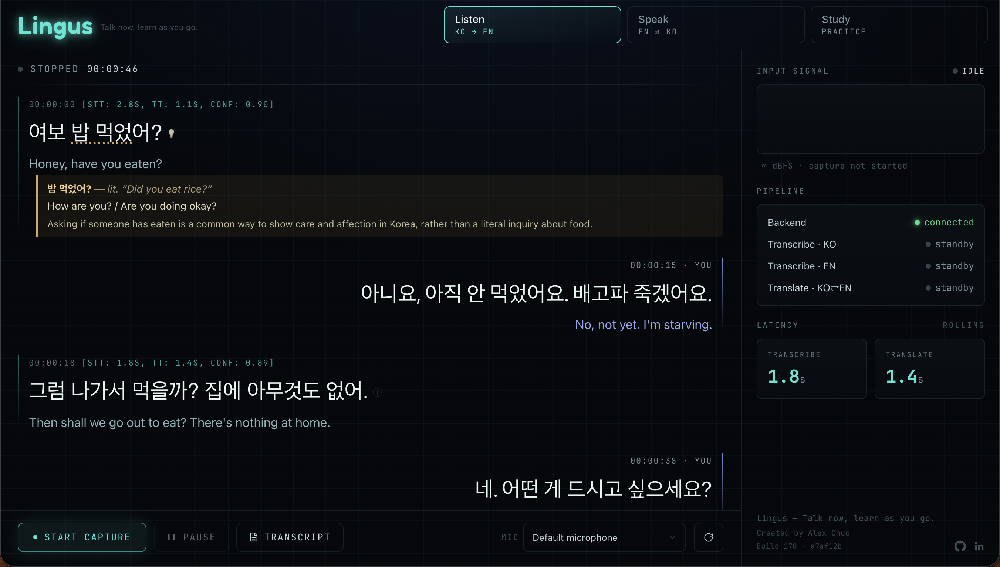

`React` `Cloudflare Workers AI` `Whisper large-v3-turbo` `Gemma 4` `Azure Speech` `Python` `nginx` `Cloudflare Tunnel` `Cloudflare Access` `Let's Encrypt` `systemd` `Raspberry Pi`
 
---

### [FitForge](https://github.com/AC-DAC/FitForge-Public)
Privacy-first workout tracking app for Android. No ads, no account required, all data stored on-device. Features custom workout creation, guided session mode, stats and insights, reminders, and QR code workout sharing. Built in React Native / Expo with a custom Material Design-inspired design system. Currently in closed testing on the Google Play Store.
 
CI/CD pipeline: GitHub Actions `test → build → submit` on version tag push. Jest unit test suite. EAS Build produces AAB artifact; EAS Submit delivers to Play Store internal track via Google Service Account (least-privilege permissions). Actions pinned to immutable commit SHAs with `permissions: contents: read` at workflow level. Lefthook + gitleaks for pre-commit secret scanning.
 
<table>
  <tr>
    <td>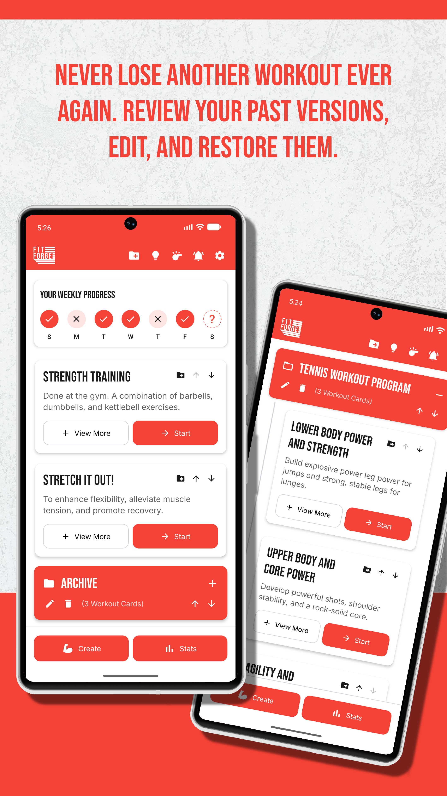</td>
    <td>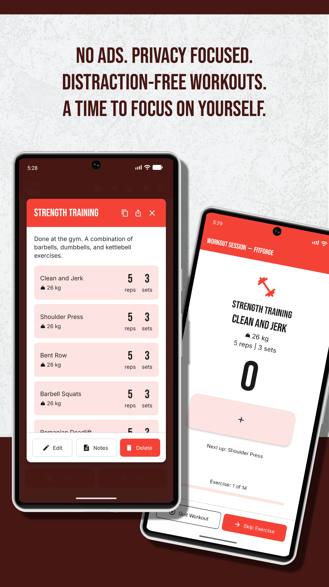</td>
    <td>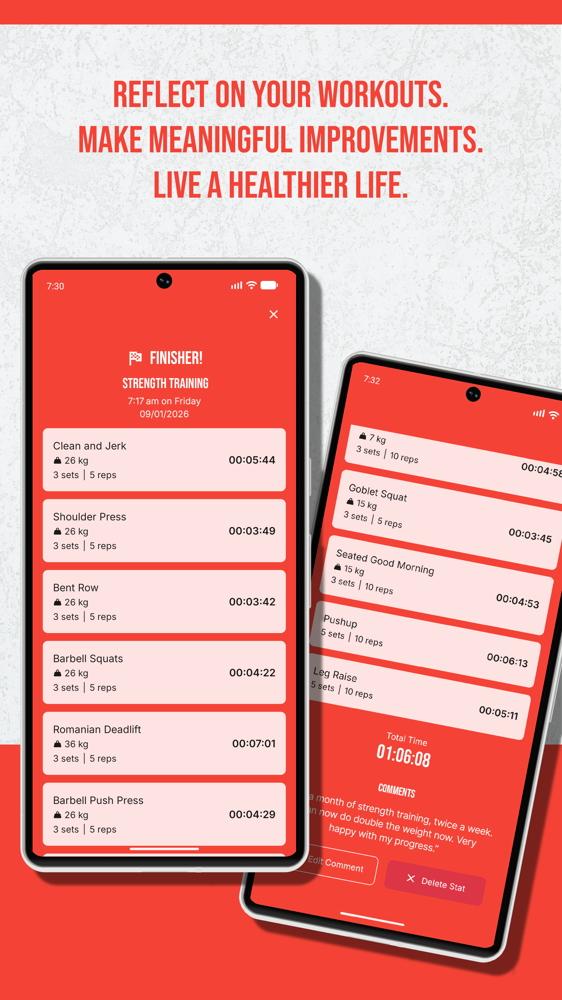</td>
  </tr>
</table>
<table>
  <tr>
    <td></td>
    <td></td>
  </tr>
  <tr>
    <td>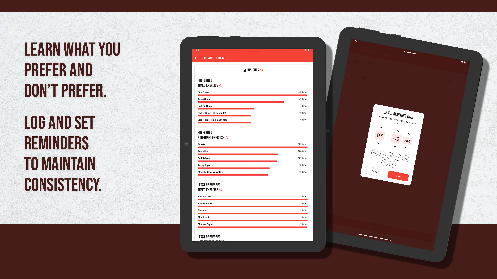</td>
    <td>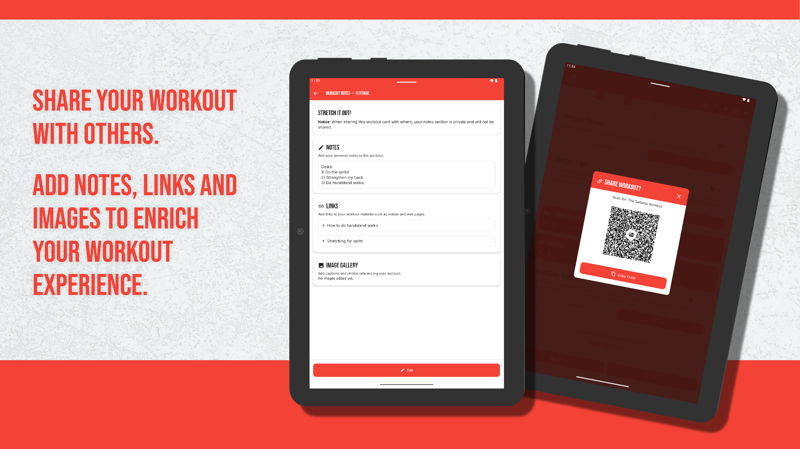</td>
  </tr>
</table>
`React Native` `Expo` `GitHub Actions` `EAS Build` `Jest` `Android`
 
---
 
### [Quicklinks](https://github.com/AC-DAC/Quicklinks-Public)
WordPress plugin built at Ironbark Marketing that generates a branded link directory page at `yourdomain.com/quicklinks/`. Customisable profile image, background and button colours, drag-and-drop link reordering. Tested up to WordPress 7.0.1 / PHP 8.3.
 
Key implementation decisions: virtual page architecture (rewrite rule + `template_redirect`) replaces the original auto-created WordPress page — nothing exists to accidentally delete or conflict with; per-version upgrade routine trashes the legacy page on overwrite-install. Self-hosted update pipeline via WordPress's native `update_plugins_ironbarkmarketing.com` filter (WP 5.8+) — token-gated JSON manifest on the Ironbark server feeds the standard wp-admin update UI and Dashboard → Updates, so clients update Quicklinks like any other plugin. CI/CD pipeline via GitHub Actions: PHPCS + WordPress-Extra ruleset, zip packaging, GitHub Release, and automated FTPS deploy of the zip and regenerated manifest to the update server on every version tag.
 
<table>
  <tr>
    <td>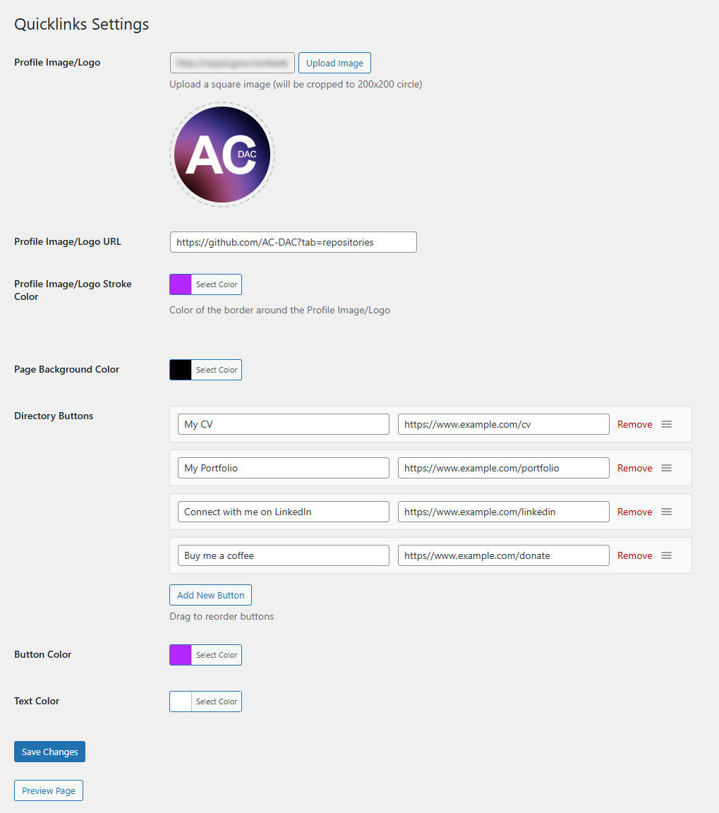</td>
    <td>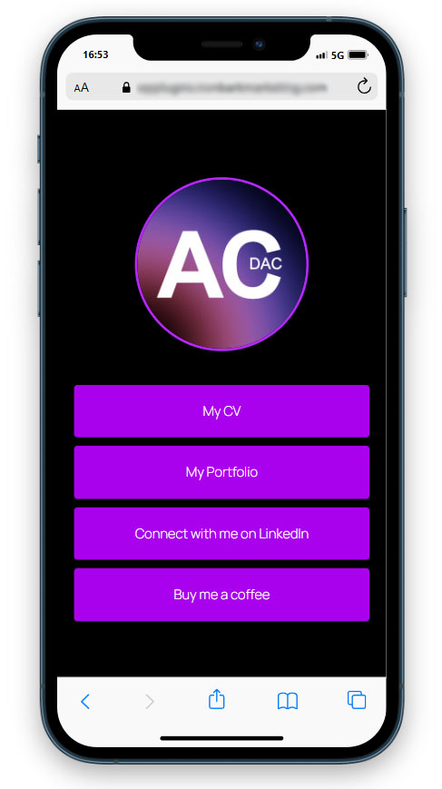</td>
    <td>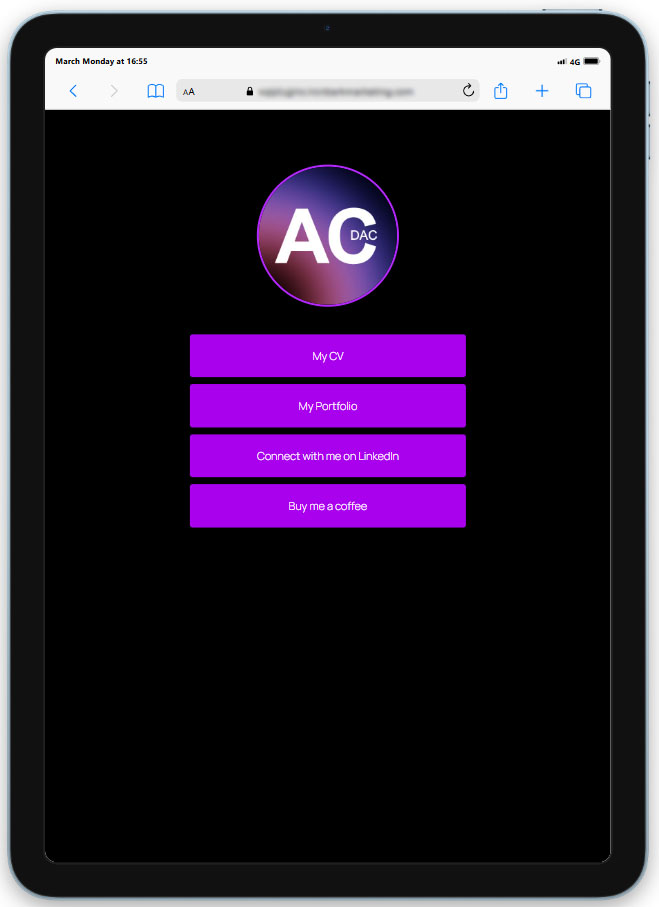</td>
  </tr>
</table>
`WordPress` `PHP` `GitHub Actions` `PHPCS`
 
---
 
### [Mothership — Centralised WordPress Management Infrastructure](https://github.com/AC-DAC/Mothership-Public)
Self-hosted centralised management dashboard for over 10 production WordPress client sites, built on MainWP and deployed to a dedicated subdomain. Replaces a manual, site-by-site update workflow with a single control plane covering bulk updates, uptime monitoring, and security visibility across all managed sites.
 
Key implementation decisions: real server-level cron over WP-Cron (unreliable on a low-traffic dashboard-only subdomain); per-site OpenSSL key pairs with Unique Security IDs replacing password authentication; maintenance mode for frontend obscurity after directory password protection was evaluated and rejected (intercepts WordPress core HTTP requests). Backup strategy layered across UpdraftPlus per-site (weekly) and VentraIP server-level hourly snapshots.
 
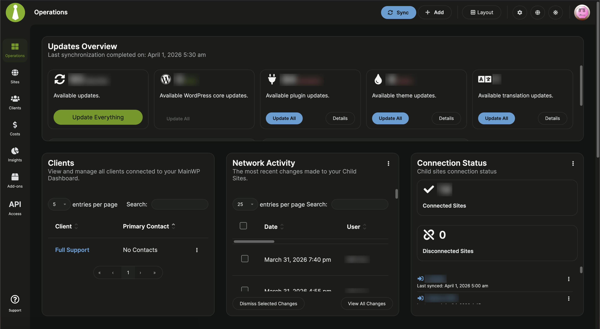
 
`MainWP` `WordPress` `Apache` `MariaDB` `Linux` `Cron`
 
---
 
### [Pi NAS — Self-Hosted Network Storage](https://github.com/AC-DAC/pi-nas)
Self-hosted NAS on a Raspberry Pi 4B, replacing an end-of-life Netgear ReadyNAS. Two 1TB NVMe SSDs in a software RAID 1 array via mdadm, served through FileBrowser Quantum over the local network. Daily incremental backup of selected folders from connected devices via rsync over SSH, managed by anacron.
 
Key implementation decisions: OMV rejected to avoid conflicts with existing Pi services; Time Machine rejected (all-or-nothing system backup); cron replaced with anacron for missed-run tolerance; FileBrowser original replaced with Quantum fork after diagnosing a routing bug in v2.63.4; powered USB hub added after diagnosing Pi 4B USB power budget limitation via dmesg. CVE patched same session as release.
 
Monitoring stack: Node Exporter + Grafana Alloy on the Pi, Prometheus + Loki + Grafana on a separate host (Docker Compose). Custom textfile collector metrics for backup job success (`backup_last_success`) and RAID array health (`raid_health`). Centralised log aggregation via Alloy → Loki — UFW blocks, SSH failures, and sudo events queryable in Grafana. Alert rules fire to email on backup failure, array degradation, high CPU, and SSH brute force detection.
 
External access via Cloudflare Tunnel — replaces port forwarding after ISP change blocked inbound ports on residential plan. Pi static IP configured via systemd-networkd for stability across router reboots.
 

 
`mdadm` `ext4` `rsync` `anacron` `systemd` `Linux` `SSH` `Prometheus` `Grafana` `Node Exporter` `Loki` `Alloy` `Cloudflare Tunnel`
 
---
 
### [Pi-hole — Network-Wide DNS Filtering & Security Review](https://github.com/AC-DAC/pihole-dns-filtering)
Network-wide DNS-based ad/tracker filtering for the home lab, deployed on the same Raspberry Pi 4B already running Pi NAS and Aersia. No application code in this repo — the deliverable is the architecture, the security review process, and two debugging case studies, written up as a standalone documentation repo rather than a thing to clone and run.
 
Key implementation decisions: four-category security review applied to the install script before execution (external fetches, obfuscation, excessive permissions, rogue persistence) rather than trusting `curl | bash` on faith; failure-domain analysis rejecting a second Pi-hole as DNS2 fallback since it would share the same host/power/storage as the primary; DNS-01 (not HTTP-01) certificate challenge for an intentionally internet-unreachable admin subdomain. Diagnosed and resolved a live incident where a port-binding conflict silently broke an unrelated service's IPv6 traffic, and separately ruled out a false alarm that looked like a filtering failure but traced to an unrelated browser privacy setting.
 
```
  LAN device ──▶ Filtering host ──▶ Matches blocklist?
                                       │             │
                                      yes            no
                                       │             │
                                       ▼             ▼
                              0.0.0.0 / NXDOMAIN   Forward to
                              (blocked locally)     upstream resolver
```
 
`Linux` `DNS` `Nginx` `systemd` `Let's Encrypt` `Security Review` `Raspberry Pi`
 
---
 
### [Aersia VIPVGM Player — Self-Hosted Fork](https://github.com/AC-DAC/aersia-vip-player-self-hosted-fork)
Self-hosted video game music player running on a Raspberry Pi 4B. Forked and significantly extended from an upstream HTML5 player: migrated playlist parsing from XML to JSON (vipvgm.net API), added sequential playback mode, Source playlist with CDN fallback logic, and Omni playlist (client-side merge of VIP, Mellow, and Exiled sorted A-Z). Full localStorage persistence across sessions with sequential position restoration fix.
 
Infrastructure: Nginx, Let's Encrypt TLS (DNS-01 challenge via Cloudflare plugin), Cloudflare Tunnel for external access (replaces dynamic DNS + port forwarding), CORS resolved via local Pi proxy serving roster files refreshed weekly by cron.
 
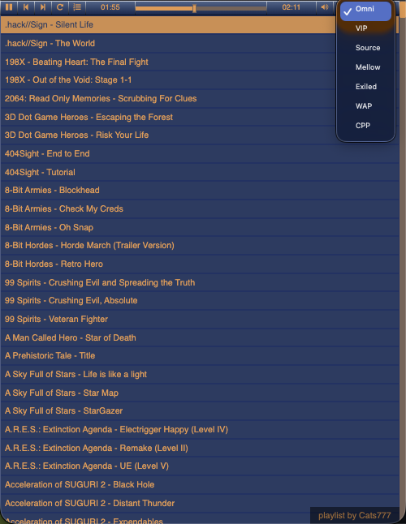
 
`Nginx` `Let's Encrypt` `Cloudflare` `Cloudflare Tunnel` `Bash` `Linux` `Cron`
 
---
 
### [Aersia VIPVGM Player — Android](https://github.com/AC-DAC/aersia-vip-player-android)
Native Android companion app to the self-hosted web player, built as a fork of [VidyaMusic by MateusRodCosta](https://github.com/MateusRodCosta/VidyaMusic). The web player originally shipped a PWA for mobile use, but background audio proved unreliable on Android due to OS power management — a native app was the correct solution.
 
Extended from upstream to achieve full playlist parity with the web player: XML/XSPF roster support for WAP and CPP playlists, Source playlist with source-file filtering, and Omni (concurrent fetch of all six playlists, merged and sorted A-Z). Per-playlist position memory with atomic snapshot persistence, shuffle state persistence, and Bluetooth auto-launch notification support.
 
CI/CD pipeline: GitHub Actions `assembleDebug` on version tag push, APK attached to GitHub Release. Actions pinned to immutable commit SHAs. Licensed AGPLv3.
 
<table>
  <tr>
    <td>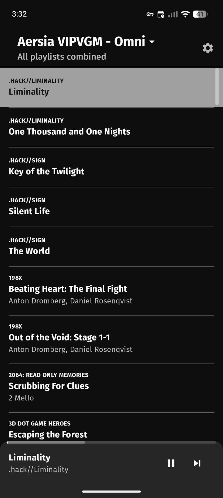</td>
    <td>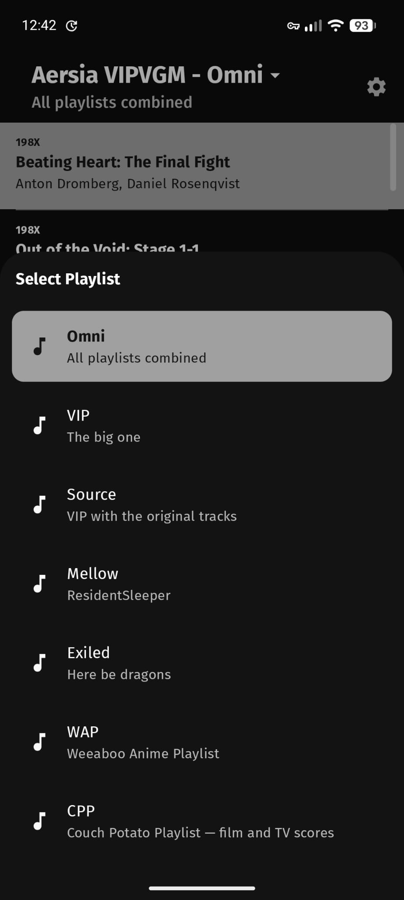</td>
    <td>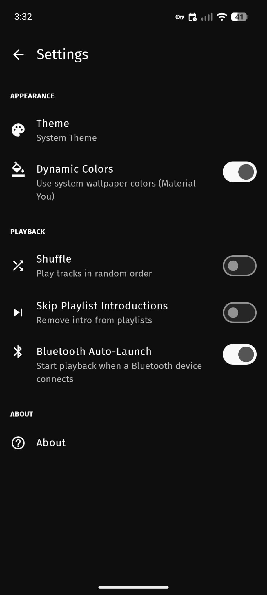</td>
    <td>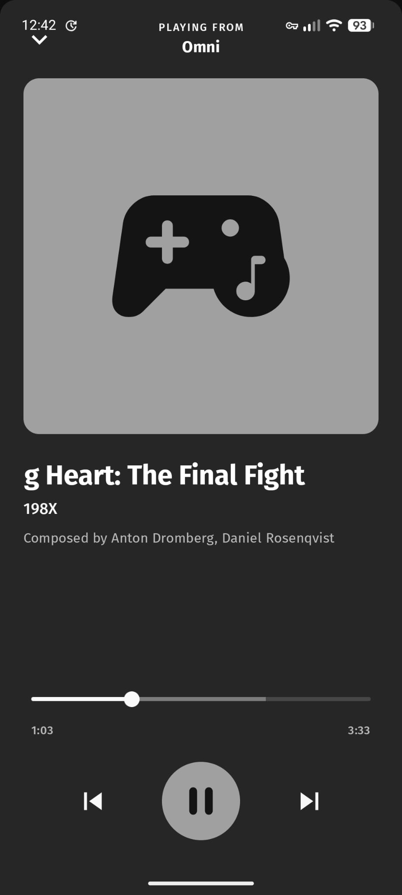</td>
  </tr>
</table>
`Kotlin` `Jetpack Compose` `Media3` `GitHub Actions` `Gradle` `Android`
 
---
 
## Technologies
 
**Infrastructure & DevOps**
Linux · Nginx · Docker · Docker Compose · GitHub Actions · Bash · Cron · Anacron · UFW · SSH · mdadm · ext4 · rsync · systemd · DNS · Cloudflare · Cloudflare Tunnel · Cloudflare Workers AI · Let's Encrypt · Certbot · EAS CLI · Prometheus · Grafana · Loki · Alloy · Node Exporter · Ansible
 
**Cloud**
AWS · IAM · VPC · EC2 · S3 · RDS · Lambda · API Gateway · AWS CLI · Secrets Manager · Terraform
 
**Development**
React Native · Expo · React · Kotlin · JavaScript · Python · PHP · HTML · CSS
 
**AI & Speech**
Whisper large-v3-turbo · Gemma 4 · Azure Speech · Cloudflare Workers AI
 
**Tools**
Git · Jest · Lefthook · EAS Build · PHPCS · Composer · gitleaks · VS Code
 
---
 
## Background
7+ years as a Digital Producer at Ironbark Marketing, spanning UI/UX design, front-end development, WordPress plugin development, and multimedia production. That background shapes how I approach infrastructure: documentation, system design, and the gap between what developers build and what operations teams maintain.
 
---
 
## Connect
[](https://www.linkedin.com/in/alexchuc/)
